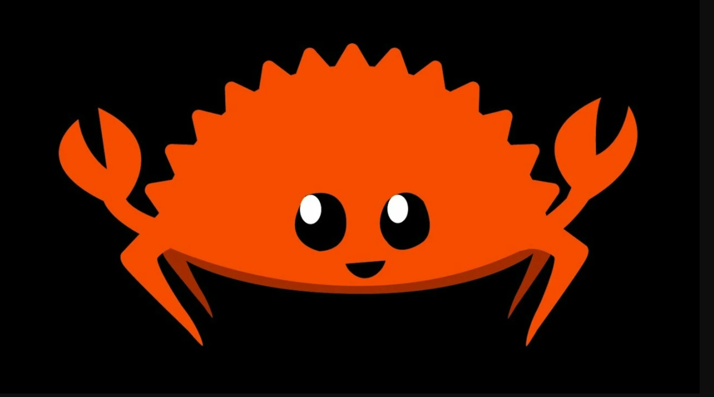

# Rust Projects

## The What and the Why

Collection of my adventures into Rust, as a python data scientist, who likes machine learning. Why? Because Rust is amazing and Ferris is really cute!

Documentation of my journey, from small projects to advanced machine learning.

## Links to various projects

* [Small Projects](https://github.com/UlrikThygePedersen/rust_projects/tree/main/small_projects)
    * [Add Numbers](https://github.com/UlrikThygePedersen/rust_projects/tree/main/small_projects/add_numbers)
    * [Operator Numbers](https://github.com/UlrikThygePedersen/rust_projects/tree/main/small_projects/operator_numbers)
    * [Hello Name](https://github.com/UlrikThygePedersen/rust_projects/tree/main/small_projects/hello_name)
    * [Fun Strings](https://github.com/UlrikThygePedersen/rust_projects/tree/main/small_projects/fun_strings)
    * [Word Counter](https://github.com/UlrikThygePedersen/rust_projects/tree/main/small_projects/word_counter)

* [Data Science](https://github.com/UlrikThygePedersen/rust_projects/tree/main/data_science)
    * [Linfa](https://github.com/UlrikThygePedersen/rust_projects/tree/main/data_science/linfa_decision_tree)